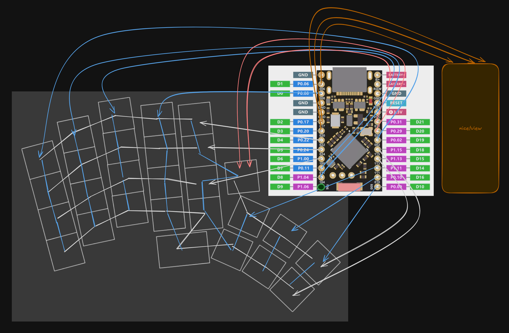

## total hour count: about 20

# May 23: The Beginning

I've decided to make a custom split-deck keyboard because I have large hands and my current keyboard doesn't really work well for long programming sessions.

I'm using a software called Ergogen to help design the keyboard because its effectively parametric (and I don't know enough about pcb design to do it fully in kicad lol).

It's going good.

As of 2:33 pm, time spent is 4 hours.

## this is taking a while

It's now 10:35 PM. I've gotten the layout to a point I'm actually really happy with. The wiring is sketchy as all hell and this is one of the most confusing things I've ever drawn.

## this took quite a while

its 11:24 PM. I've added a battery connector, power switch, and reset button. Still need to route the whole thing and do the CAD for the case.

but it looks sick!

# May 25: It Continues.

So turns out I accidentally did something wrong and direct-wired my ground pin. It's why freerouting was absolutely dying when I tried to use it lol.

Fixing that, then have to work on the pcb.
time: 6:46 AM

# May 27: Finished!

time: 5:24 AM

I had a migraine since my last journal entry, so I had to take a break for a while.

Today I spent most of my time routing the PCB. I redid my "schematic" in Excalidraw and came up with this:

Still doesn't make any sense, but I could at least follow it enough to make the PCB itself. And redo the configuration files.

Overall, I'm pretty proud of how the PCB came out. It's fully reversible and while I did mess up and have to re-route the entire thing, it came out well.

I also coated it in silkscreen art, that was fun.

Thanks for reading
