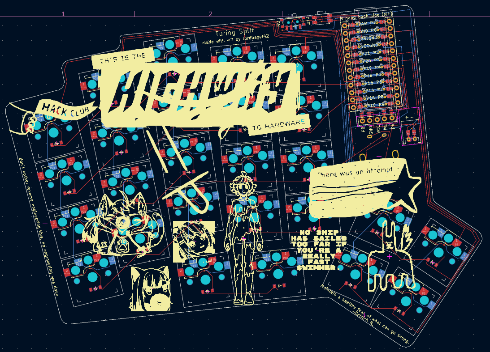
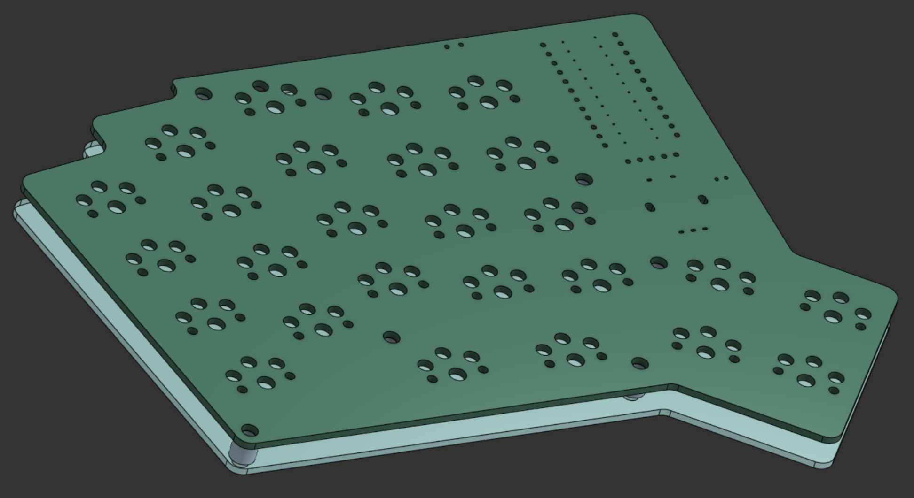
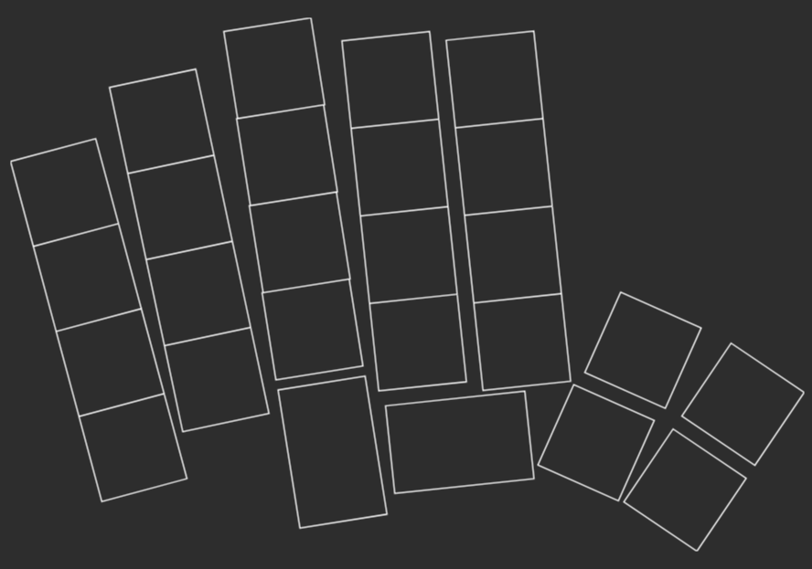

# Turing Split - HIGHWAY

this ^ will be replaced with a photo of the actual keyboard once it's built

## why?

I type a lot. Like, an insane amount. I write code for my robotics team and a lot for Hack Club, so I need a decent keyboard.
I've been using the Apple Magic Keyboard for a long while, and it's honestly quite nice. I originally bought it because my Quest 2 can track it.

However, I also am prone to carpal tunnel and other hand/fingie-issues, so I figured I should get a keyboard.
This led me to a discovery: Keyboards, are not cheap.

Then I discovered Highway and had a thought: make someone else pay for my keyboard.

## my keyboard design

I was tempted to go all out and build a full desk size keyboard contraption, but then I found [ergogen](https://ergogen.ceoloide.com/?exp=kicanvas) and decided to make an ergonomic, split-deck keyboard.
I based this off of a lot of random keyboards I saw throughout the internet and had one main focus when designing: comfortable, but not confusing.

I like layers. I plan to use them. I also want to have enough buttons I can do things easily and without thinking. If I wanted chords, I would have made a stenography keyboard.

This isn't the most complicated design, it's not the most simple, but it is mine, and I feel happy with it.

## the bom

Overall, the cost comes out to about $180 w/ tax.

| ITEM                  | SUPPLIER        | COUNT | UNIT COST | ROW COST | LOW BUDGET USE | HIGH BUDGET USE |
| --------------------- | --------------- | ----- | --------- | -------- | -------------- | --------------- |
| nice!nano v2          | typeractive.xyz | 1     | $25.00    | $25.00   | 17%            | 7%              |
| nice!view             | typeractive.xyz | 1     | $20.00    | $20.00   | 13%            | 6%              |
| PCB                   | JLCPCB          | 1     | $12.00    | $12.00   | 8%             | 3%              |
| PCB Shipping          | JLCPCB          | 1     | $25.00    | $25.00   | 17%            | 7%              |
| Kailh Hotswap Sockets | typeractive.xyz | 60    | $0.15     | $9.00    | 6%             | 3%              |
| Battery Jack          | typeractive.xyz | 2     | $0.50     | $1.00    | 1%             | 0%              |
| 1.5u Keycap           | typeractive.xyz | 4     | $0.50     | $2.00    | 1%             | 1%              |
| Homing Keycap         | typeractive.xyz | 2     | $0.50     | $1.00    | 1%             | 0%              |
| Keycap                | typeractive.xyz | 50    | $0.40     | $20.00   | 13%            | 6%              |
| Choc Switches         | typeractive.xyz | 60    | $0.55     | $33.00   | 22%            | 9%              |
| Diodes                | typeractive.xyz | 60    | $0.08     | $4.50    | 3%             | 1%              |
| Power Switch          | typeractive.xyz | 2     | $0.75     | $1.50    | 1%             | 0%              |
| Sockets and Pins      | typeractive.xyz | 2     | $6.50     | $13.00   | 9%             | 4%              |
| Encoder               | aliexpress      | 2     | $1.10     | $2.20    | 1%             | 1%              |

## notes

Something to note about this is a bit of a habit I've picked up from my apple keyboard: I don't like thick keyboards. My magic keyboard is maybe 7 millimeters tall at maximum and about 3 at the minimum. I am okay with something a bit thicker, but I don't want something as thick as a normal keyboard.

This is also part of why I went for low profile keys and keycaps, hence the Choc switches instead of the more common MX switches.

I also don't want a case to help with that. Because of the requirements for Highway, I have one. It's a very thin case designed to be lasercut using acrylic and 3d printed standoffs.
